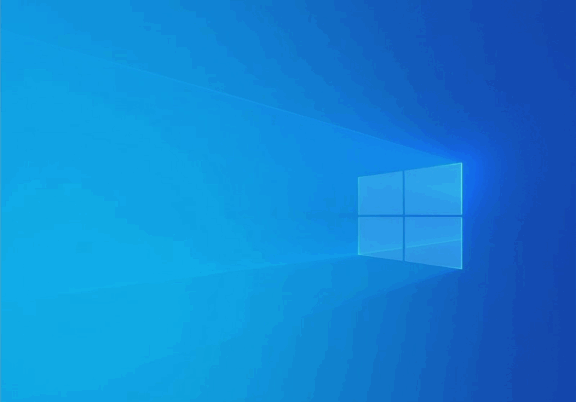

screenshot
========

screenshot is a Windows application for taking Desktop screen captures.



Default Controls
--------
`PrtSc` displays the selection screen.<br>
`Esc` closes the selection screen.<br>
`Left Click` creates, resizes or moves a selection.<br>
`Shift + Left Click` converts a selection to a square.<br>
`1` proportionally downscales a selection.<br>
`2` proportionally upscales a selection.<br>
`F` shows a selection outline (and aspect ratio if specified).<br>
`R` reloads the config file.<br>
`~` opens the config file.<br>
`Ctrl+A` selects the entire screen.<br>
`Ctrl+C` copies a selection.<br>
`Ctrl+E` opens a selection in paint.<br>
`Ctrl+S` saves a selection.<br>
`Ctrl+W` deselects, then closes the selection screen.<br>
`Ctrl+Y` redoes a selection.<br>
`Ctrl+Z` undoes a selection.<br>

Installation
--------
First, run:

	vcvarsall.bat x64

Then compile with:

	cl /ZI /D _UNICODE /D UNICODE main.c User32.lib Gdi32.lib Shlwapi.lib Shell32.lib Pathcch.lib /Fe:screenshot.exe

If you want to add the app to startup, run `install.bat`.

Otherwise, manually run the app as admin.

Configuration
--------
To configure the app, make a file called `screenshot.ini` in the same directory as the executable with the following structure:

```
[keys]
screen_capture=0x2c
close=0x1b
downscale=1
upscale=2
selection_outline=f
reload_config=r
open_config=0xc0
select_all=ctrl+a
copy=ctrl+c
open_in_paint=ctrl+e
save=ctrl+s
deselect=ctrl+w
redo=ctrl+y
undo=ctrl+z

[output]
screenshot_directory=C:\Users\username\Desktop
screenshot_prefix=Screenshot_

[display]
show_aspect_ratio=1
```