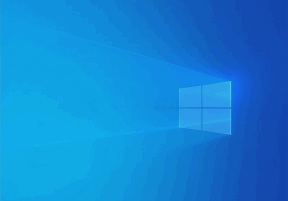

screenshot
========

A screen capture tool for Windows.



Remarks
--------
I created this because I was discontent with Lightshot's resizing logic where you always have to start by positioning your cursor on a small anchor point.
As a result, I made it so you can resize a selection similar to how you resize a window in the operating system, as shown in the demo above.
On top of that, I implemented other unique features as well, which are listed below.

Default Controls
--------
`PrtSc` displays the selection screen.<br>
`Esc` closes the selection screen.<br>
`Left Click` creates, resizes or moves a selection.<br>
`Shift + Left Click` converts a selection to a square.<br>
`1` proportionally downscales a selection.<br>
`2` proportionally upscales a selection.<br>
`F` shows a selection outline (and aspect ratio if specified).<br>
`R` reloads the config file.<br>
`~` opens the config file.<br>
`Ctrl+A` selects the entire screen.<br>
`Ctrl+C` copies a selection.<br>
`Ctrl+E` opens a selection in paint.<br>
`Ctrl+S` saves a selection.<br>
`Ctrl+W` deselects, then closes the selection screen.<br>
`Ctrl+Y` redoes a selection.<br>
`Ctrl+Z` undoes a selection.<br>

Installation
--------
With Visual Studio installed, you can run:

	vcvarsall.bat x64

Then compile with:

	cl /ZI /D _UNICODE /D UNICODE main.c User32.lib Gdi32.lib Shlwapi.lib Shell32.lib Pathcch.lib /Fe:screenshot.exe

If you want to add the executable to startup, run `install.bat`.

Otherwise, manually run it as admin.

Configuration
--------
To configure keyboard shortcuts and other settings, make a file called `screenshot.ini` in the same directory as the executable with the following structure:

```
[keys]
screen_capture=0x2c
close=0x1b
downscale=1
upscale=2
selection_outline=f
reload_config=r
open_config=0xc0
select_all=ctrl+a
copy=ctrl+c
open_in_paint=ctrl+e
save=ctrl+s
deselect=ctrl+w
redo=ctrl+y
undo=ctrl+z

[output]
screenshot_directory=C:\Users\username\Desktop
screenshot_prefix=Screenshot_

[display]
show_aspect_ratio=1
```

Attributions
--------
1. `stb_image_write.h` from [stb](https://github.com/nothings/stb) by Sean Barrett, [The Unlicense](https://unlicense.org/)